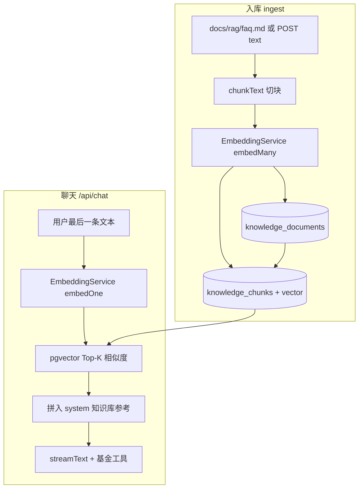

# RAG 向量检索打通记录

本文档记录在本项目（AI_demo）中从零打通 **RAG（Retrieval-Augmented Generation，检索增强生成）** 最小链路的完整过程，便于复习、交接与后续扩展。

**验证标准**：用户在前端聊天问「持仓收益怎么计算」，助手能依据 `docs/rag/faq.md` 入库后的知识回答，并出现「根据知识库中的说明」类表述。

---

## 1. 目标与范围

### 1.1 要解决的问题

- 基金助手除 **实时工具**（查净值、记持仓）外，还需要回答 **说明性、规则类** 问题（FAQ、产品说明等）。
- 这类知识适合 **向量检索 + 拼进提示词**，而不是全部写死在 `system` 里。

### 1.2 本次实现的范围（MVP）

| 包含 | 不包含（可后续做） |
|------|-------------------|
| PostgreSQL + **pgvector** 存向量 | 独立向量库（Milvus、Pinecone） |
| 百炼 **text-embedding-v3**（1024 维） | PDF/Word 自动解析 |
| `ingest` / `search` HTTP API | 前端知识库管理页 |
| `/api/chat` 自动检索并注入 system | RAG 做成独立 tool |
| 演示语料 `docs/rag/faq.md` | 混合检索（BM25 + 向量）、重排序 |

---

## 2. 整体架构



**数据流一句话**：

1. **入库**：原文 → 切块 → 每块调 embedding API → 写入 `knowledge_chunks.embedding`（`vector(1024)`）。
2. **聊天**：用户问题 → 同样模型转向量 → 在库中找最接近的块 → 文本塞进 `system` → 再走原有流式对话与工具。

---

## 3. 基础设施

### 3.1 数据库：PostgreSQL + pgvector

- Docker 镜像由 `postgres:16` 改为 **`pgvector/pgvector:pg16`**（见 `backend/docker-compose.yml`）。
- 在库中执行：`CREATE EXTENSION IF NOT EXISTS vector;`
- 若从旧镜像迁移数据卷，可能出现 **collation 版本警告**；学习环境可 `ALTER DATABASE fund_coach REFRESH COLLATION VERSION`，或 `docker compose down -v` 重建（会清空用户/持仓，需重新注册）。

### 3.2 业务表（Prisma）

| Prisma 模型 | 数据库表 | 说明 |
|-------------|----------|------|
| `KnowledgeDocument` | `knowledge_documents` | 文档元信息（title、source） |
| `KnowledgeChunk` | `knowledge_chunks` | 切块正文 + `embedding vector(1024)` |

迁移目录：`backend/prisma/migrations/20260523124405_add_knowledge_rag/`

`embedding` 在 schema 中为 `Unsupported("vector(1024)")`：Prisma Client **不能直接读写**该字段，入库与检索使用 **`$executeRaw` / `$queryRaw`**。

### 3.3 向量化模型

- **与聊天模型不是同一个**：聊天用 `qwen-turbo` / `deepseek-chat` 等；向量化用 **`text-embedding-v3`**。
- **API Key 可复用**：`DASHSCOPE_API_KEY`（百炼），Base URL 与聊天相同（OpenAI 兼容模式）。
- **维度必须一致**：模型输出 **1024 维** ↔ 表字段 `vector(1024)` ↔ `EMBEDDING_DIMENSIONS=1024`。
- 单条文本上限约 **8192 token**（百炼文档）；本项目切块默认 **500 字符 + 80 重叠**，远低于上限。

---

## 4. 实施步骤（四步）

### 第一步：Prisma 建表 + 迁移

1. 在 `backend/prisma/schema.prisma` 增加 `KnowledgeDocument`、`KnowledgeChunk`。
2. 在 `backend` 目录执行（**勿在 frontend 目录**，避免 npx 拉到错误版本 Prisma）：

   ```powershell
   cd backend
   npx prisma migrate dev --name add_knowledge_rag --create-only
   ```

3. 检查 `migration.sql` 中 `embedding` 为 `vector(1024)`，文件头含 `CREATE EXTENSION IF NOT EXISTS vector;`。
4. 应用迁移并生成 Client：

   ```powershell
   npx prisma migrate dev
   npx prisma generate
   ```

5. 验收：

   ```powershell
   docker exec fund_coach_db psql -U admin -d fund_coach -c "\dt"
   docker exec fund_coach_db psql -U admin -d fund_coach -c "\d knowledge_chunks"
   ```

### 第二步：Embedding 服务

- 模块：`backend/src/knowledge/embedding.service.ts`
- 方法：`embedOne(text)`、`embedManyTexts(texts)`（批量每批最多 10 条，符合百炼限制）。
- 验证：

  ```powershell
  cd backend
  npm run test:embedding
  ```

  应输出 `维度: 1024` 与 `OK`。

### 第三步：入库与检索 API

| 接口 | 方法 | 鉴权 | 说明 |
|------|------|------|------|
| `/api/knowledge/ingest` | POST | JWT | 写入知识库 |
| `/api/knowledge/search` | POST | JWT | 调试检索，返回 Top-K 片段 |

**ingest 请求示例（读演示 FAQ）**：

```json
{
  "title": "基金持仓 FAQ",
  "loadDemoFaq": true
}
```

或直接传全文：

```json
{
  "title": "自定义标题",
  "text": "长文本……",
  "source": "manual"
}
```

**search 请求示例**：

```json
{
  "query": "持仓收益怎么计算",
  "topK": 3
}
```

**重要**：`docs/rag/faq.md` **不会自动入库**；必须至少调用一次 `ingest`，`KnowledgeDocument` / `KnowledgeChunk` 才会有数据。

脚本验证：

```powershell
$env:TOKEN="登录后 localStorage 的 auth_token"
npm run test:knowledge
```

JWT 获取：浏览器 F12 → Application → Local Storage → `auth_token`。

### 第四步：接入聊天 `/api/chat`

- 文件：`backend/src/ai/chat.service.ts`
- 逻辑：在 `streamText` 前，取用户**最后一条文本** → `KnowledgeService.search` → 将命中片段格式化为【知识库参考】拼入 `system`。
- `AiModule` 已 `imports: [KnowledgeModule]`。

---

## 5. 环境变量

在 `backend/.env` 中配置（示例见 `backend/env.example`）：

```env
# 向量化（复用百炼 Key）
DASHSCOPE_API_KEY=sk-xxx
EMBEDDING_PROVIDER=dashscope
EMBEDDING_MODEL=text-embedding-v3
EMBEDDING_DIMENSIONS=1024

# 聊天内 RAG
RAG_ENABLED=true
RAG_TOP_K=3
RAG_MIN_SCORE=0.25

# 切块（ingest 用）
RAG_CHUNK_SIZE=500
RAG_CHUNK_OVERLAP=80
```

| 变量 | 默认 | 含义 |
|------|------|------|
| `RAG_ENABLED` | `true` | 是否在 `/api/chat` 中检索 |
| `RAG_TOP_K` | `3` | 最多几条参考片段 |
| `RAG_MIN_SCORE` | `0.25` | 相似度下限（`score = 1 - 余弦距离`） |
| `RAG_CHUNK_SIZE` | `500` | 切块字符数 |
| `RAG_CHUNK_OVERLAP` | `80` | 块间重叠字符数 |

---

## 6. 代码结构

```
backend/src/knowledge/
├── embedding.service.ts      # 调用 text-embedding-v3
├── knowledge.service.ts      # ingest、search、formatHitsForSystemPrompt
├── knowledge.controller.ts   # POST ingest / search
├── knowledge.module.ts
├── chunk-text.util.ts        # 文本切块
├── pg-vector.util.ts         # 向量字面量 [f1,f2,...]
└── dto/
    ├── ingest-knowledge.dto.ts
    └── search-knowledge.dto.ts

backend/src/ai/
├── chat.service.ts           # buildSystemWithRag
└── ai.module.ts              # imports KnowledgeModule

docs/rag/
├── faq.md                    # 演示语料（ingest 源文件）
└── RAG打通记录.md            # 本文档

backend/scripts/
├── test-embedding.mjs
└── test-knowledge-rag.mjs
```

---

## 7. 端到端验证清单

- [ ] Docker 数据库已启动：`cd backend && docker compose up -d`
- [ ] 表存在：`\dt` 含 `knowledge_documents`、`knowledge_chunks`
- [ ] `npm run test:embedding` 通过（1024 维）
- [ ] `npm run test:knowledge` 或 Postman ingest 成功，`chunkCount >= 1`
- [ ] Prisma Studio 中 KnowledgeDocument / KnowledgeChunk 有数据（需点 Tab 旁 **+** 切换模型）
- [ ] 前端登录后问「持仓收益怎么计算」，回答引用知识库表述

---

## 8. 常见问题

### 8.1 Prisma Studio 里「只有 User 一张表」？

- 库里实际有多张表；Studio **一次只开一个模型 Tab**，需点 **User 右侧的 `+` → Open a Model** 选择 `Holding`、`KnowledgeDocument`、`KnowledgeChunk`。
- 也可用：`docker exec fund_coach_db psql ... -c "\dt"` 或 DBeaver 连 `localhost:5432`。

### 8.2 `prisma generate` 报 EPERM？

- Windows 上 `query_engine-windows.dll.node` 被占用。先 **Ctrl+C** 停 `npm run dev` 和 Prisma Studio，再 `npx prisma generate`。

### 8.3 Knowledge 表一直是空的？

- 未执行 **ingest**。调用 `POST /api/knowledge/ingest` 或 `npm run test:knowledge`。

### 8.4 在 frontend 目录跑 `npx prisma` 报错？

- 必须在 **`backend`** 目录执行，或使用 `npm run prisma:migrate`（backend 的 package.json 脚本）。

### 8.5 聊天没有用到知识库？

- 检查 `RAG_ENABLED`、是否已 ingest、`RAG_MIN_SCORE` 是否过高导致片段被过滤。
- 后端日志若有 `[ChatService] RAG 检索跳过` 表示检索失败，聊天仍会继续（降级为无 RAG）。

### 8.6 重复 ingest

- 每次 ingest 会 **新增** 一条 `KnowledgeDocument`，不会覆盖旧文档；生产环境需自行做「按 source 去重/版本管理」。

---

## 9. 与现有能力的关系

| 能力 | 数据来源 | 方式 |
|------|----------|------|
| 持仓、净值、记仓 | 数据库 + 基金 API | **工具**（`recordHolding`、`analyzePortfolio` 等） |
| FAQ、规则说明 | `knowledge_chunks` | **RAG 检索** 拼 system |

原则：**数字与实时状态走工具；长文档说明走 RAG**。不要指望向量库替代持仓查询。

---

## 10. 后续可扩展方向

1. ingest 支持上传文件、按 `source` 覆盖更新。
2. `knowledge_chunks` 上建 HNSW 索引（数据量大时加速）。
3. 检索结果展示在前端（引用来源、相似度）。
4. 混合检索 + rerank；多租户按 `userId` 隔离知识库。
5. 将本文档链接写入根目录 `README.md` 的 docs 索引。

---

## 11. 相关文档

- [后端聊天流程](../后端聊天流程.md)
- [AI 接口配置](../backend/AI接口配置.md)
- [Prisma 设置](../backend/Prisma设置.md)
- [连接数据库](../backend/连接数据库.md)
- 演示语料：[faq.md](./faq.md)

---

*文档版本：与 2026-05 项目 RAG MVP 实现同步。*
